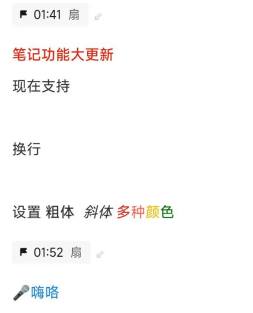
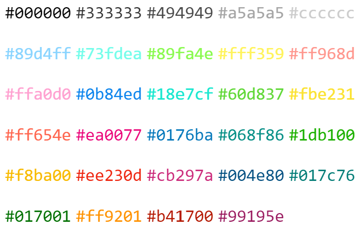

# Bilibili 自动打轴助手

通过本工具可以将统一的时间轴自动转换到不同的录播笔记。

首先，请确保准备好配置文件和数据文件。通过执行根目录的 `init.cmd` 或 `init.sh` 可展开示例数据。

## 生成时间轴

### 教程

1. 新建存放原始文本轴的文本文件（一般放在 `data` 目录下）
2. 修改 `config/gen_timeline.json`, 填入这些文本文件的路径和这些分p对应的偏移量，同时填入输出文件路径
3. 执行 `python gen_timeline.py` 即可生成转换的时间轴文件（`csv` 或 `pbf`）
4. 如果配置文件在其他位置，执行 `python gen_timeline.py <配置文件路径>`

### 配置文件示例 (json文件)

    {
        "$schema": "../schema/gen_timeline.schema.json",
        "offsets": [-585, 2344],
        "parts": ["./data/p1.txt", "./data/p2.txt"],
        "out": "./data/timeline.csv"
    }

### 配置文件说明

* `$schema`: 配置文件格式规范。仅在编辑此文件时生效；有或没有此项、此项内容如何均不会影响程序的正常功能。但在有此项的情况下，使用 Visual Studio Code 等编辑器对配置文件进行编辑时，可以自动弹出每项内容的说明并自动补齐部分项目。
* `offsets`: 参考视频每个分P开始时刻对应的统一时间轴时刻，单位为秒。注意，此处的值可能为负数（比如果统一时间轴以开场对齐，但视频中包含OP时）
* `parts`: 每个视频文本轴的路径
* `out`: 输出时间轴路径。当路径以 `.pbf` 结尾时，会生成适配 PotPlayer 的事件轴文件；其他情况会生成 `csv` 文件，用于后续进一步操作

### 文本轴示例

    09:45 《Next Level》
    12:04 枝江gamer们的自我介绍
    13:04 本次游戏的最大奖品竟然是她？*
    14:12 四位参赛选手的赛前采访
    15:44 分 赃 现 场*

## 输出时间轴示例 (csv文件)

    1,开场
    10,这是一个简单的时间轴的示例
    11,用于时间轴的自动化上传测试
    20,第一列表示时间戳对应的时刻
    21,单位为秒，如这行表示第21秒
    22,文件中的时间戳基于开场时刻
    23,假设这个分p 的op的长10秒
    24,那么第 8行则会显示为第31秒
    30,第二列为时间戳对应显示内容
    43,重要标记用红色加粗形式显示
    50,笔记测试结束了，大家晚安啦
    60,回马枪

## 时间轴的Mask

在csv中的一些条目后可以添加mask，表示隐藏部分时间标签。数字0,1,2,...对应于不同的token

    1,开场
    10,这是一个mask示例,10

如上述示例csv，假设存在3个token，那么`开场`条目将显示全部三个时间标签，`这是一个mask示例`条目将只会显示第三个时间标签（因为序号0和1的时间标签均被隐藏了）

另外注意，由于Excel的编辑机制，在添加时间标签时推荐将数字0后置

## 轴文本中的控制字

可在轴文本中增加一些控制指令，单独调整每个部分的配置。
例如，设置轴内容为

    [B|#ee230d]笔记功能大更新[N|R]现在支持[N|N]换行[N|N]设置[B] 粗体 [R|I] 斜体 [R|#ee230d]多[#ff654e]种[#f8ba00]颜[#017001]色

显示效果为

控制指令放在方框内，使用竖线进行分隔，指令具体包括

| 指令名    | 含义                             |
|----------|----------------------------------|
| B        | 粗体                              |
| I        | 斜体                              |
| U        | 下划线                            |
| S        | 删除线                            |
| AL       | 左对齐（默认）                     |
| AC       | 居中                              |
| AR       | 右对齐                            |
| #123456  | 字体颜色（见颜色表）                |
| b#123456 | 背景颜色（见颜色表）                |
| s17      | 设置字号大小(可选17/18/20/22/24)    |
| i123456  | 图片id(使用image_uplpader.py上传)  |
| R        | 将颜色、粗体、斜体等重置为默认值。注意：不会重置对齐方式 |
| l链接名   | 下一个链接显示的名称                |
| N        | 插入换行符                         |

除非被新的指令替代，字体样式指令的作用范围将持续到轴条目的末尾

### 字体颜色表

#000000
#333333
#494949
#a5a5a5
#cccccc

#89d4ff
#73fdea
#89fa4e
#fff359
#ff968d

#ffa0d0
#0b84ed
#18e7cf
#60d837
#fbe231

#ff654e
#ea0077
#0176ba
#068f86
#1db100

#f8ba00
#ee230d
#cb297a
#004e80
#017c76

#017001
#ff9201
#b41700
#99195e
#ffffff

## 发布时间轴

### 教程

1. 确保已拥有主时间轴的 csv 文件（一般放在 `data` 目录下）
2. 修改 `config/pub_timeline.json`, 填入 cookie 和视频信息等
3. 执行 `python pub_timeline.py` 将时间轴发布至B站
4. 如果配置文件在其他位置，执行 `python pub_timeline.py <配置文件路径>`

### 获取 Cookie

* cookie 可使用 `F12` 开发人员工具从 Bilibili 网页端抓包
* 有了 cookie 能操作B站账号的大部分功能，切勿泄露或分享出去
* 请确保 cookie 中包含 `SESSDATA` 和 `bili_jct` 两项
* 为防广告，一些小号可能没有发布笔记的功能，请先在网页端进行发布笔记的测试
* 每人每天最多发布 5 篇笔记

### 配置文件示例 (json文件)

    {
        "$schema": "../schema/pub_timeline.schema.json",
        "cookie": "SESSDATA=<SESSDATA>; bili_jct=<CSRF>",
        "bvid": "BV15U4y1d7TX",
        "timeline": "./data/timeline.csv",
        "template": "./data/template.rst",
        "tokens": [
            {
                "key": "弹幕",
                "offsets": [-52, "auto"],
                "marker": "弹",
                "jumpOpDesc": "🪂点此跳过OP (弹幕版)"
            },
            {
                "offsets": [-52, "auto"],
                "jumpOpDesc": "🪂点此跳过OP (纯净版)"
            }
        ],
        "ignoreThreshold": 600,
        "cover": "这是一个多P自动发布笔记的测试\n欢迎进入笔记打轴的自动化时代",
        "publish": true,
        "autoComment": true,
        "watch": false,
        "confirm": false,
        "hidePart": false,
        "hidePartTitle": false,
        "titlePrefix": "[AC|b#fff359|s18]",
        "titlePostfix": "",
        "subTitlePrefix": "[AC|B]",
        "subTitlePostfix": "",
        "songDanceTitle": "[AC|B|b#ffa0d0|s18]　　　本场歌舞快速导航　　　"
    }

### 配置文件说明

**注意：2023年1月8日更新后移除了offsets和danmakuOffsets两个选项，转而使用tokens配置。旧版本配置文件将不兼容，请注意修改**

**注意：2023年1月21日更新后移除了文档结构配置选项，转而使用template配置。旧版本配置文件将不兼容，请注意修改**

* `$schema`: 配置文件格式规范。仅在编辑此文件时生效；有或没有此项、此项内容如何均不会影响程序的正常功能。但在有此项的情况下，使用 Visual Studio Code 等编辑器对配置文件进行编辑时，可以自动弹出每项内容的说明并自动补齐部分项目。
* `cookie`: 发送笔记用户的cookie，必须包含 `SESSDATA` 和 `bili_jct` 两项
* `bvid`: 目标视频BV号
* `timeline`: 时间轴文件路径
* `template`: 笔记模板文件路径
* `tokens`: 视频分P的不同类别
  * `key`: 用来识别这个类别的关键词
  * `offsets`: 目标视频每个分P开始时刻对应的统一时间轴时刻，单位为秒。注意，此处的值可能为负数（比如果统一时间轴以开场对齐，但视频中包含OP时）。
    在offsets中也可以标记`auto`或`skip`，`auto`表示自动叠加上一p的累计时长，`skip`表示跳过这一p
  * `marker`: 在时间胶囊中显示的内容
  * `jumpOpDesc`: 跳过OP按钮显示的内容
* `ignoreThreshold`: 时间短于此值的分P将被忽略，单位为秒，默认为600（即10分钟）。此参数用于处理占位视频。被忽略的视频不会参与到 `offsets` 和 `danmakuOffsets` 的推断中
* `cover`: 视频转制通过时发送至评论区的文案
* `publish`: 是否自动发布
* `autoComment`: 笔记发布后是否自动发评论
* `watch`: 是否监控视频和笔记更新。设置为`true`将自动监控视频分P和笔记文件的变化，每次目标视频分P变化或笔记文件更新时将自动更新笔记。当视频总分P数量等于offset设定值，并且笔记文件2小时未更新，则监控自动结束、程序退出
* `confirm`: 是否弹出确认选项
* `hidePart`: 隐藏时间标签中的分P标识。推荐在超过3个时间标签或者纯净/弹幕各1P时打开此项
* `hidePartTitle`: 隐藏时间轴中的分P标签条。如果设置了此项，建议在template文件中手动添加总标题条。
* `titlePrefix`等：控制轴内标题样式和歌舞导航标题样式。`Prefix`为前缀，`Postfix`为后缀

### template文件说明

template文件为笔记内容的模板，样例如下

    .. jump_op
    [B|#ff654e]欢迎大家来看今天的直播！
    [i124497]
    .. song_dance
    [AC|B|b#ffa0d0|s18]快速链接
    .. abstract
    .. body
    [i124497]

    [#cccccc]作者：AS042971

其中，`.. jump_op`、`.. song_dance`、`.. body`、`.. abstract`四个模块在程序运行时会被替换为跳过OP按钮、歌舞导航区、笔记主体区和精简笔记区；其余的行按照先前的富文本规则解析。
精简笔记区内轴文本的首行会直接合并进时间胶囊

## 小工具：监控评论区

执行 `python comment_monitor.py <目标视频BVID> <监测用户名> <pushplus_token>`即可在被监测用户发评论时收到通知
* 特别提示
  1. pushplus_token不是必须参数,选填该参数可以激活微信推送
  2. pushplus_token从 [此处](https://www.pushplus.plus)申请并绑定微信
  3. 接口限制：1分钟内接收5次请求，1小时3次重复信息，1天200条推送

## 后续更新计划
